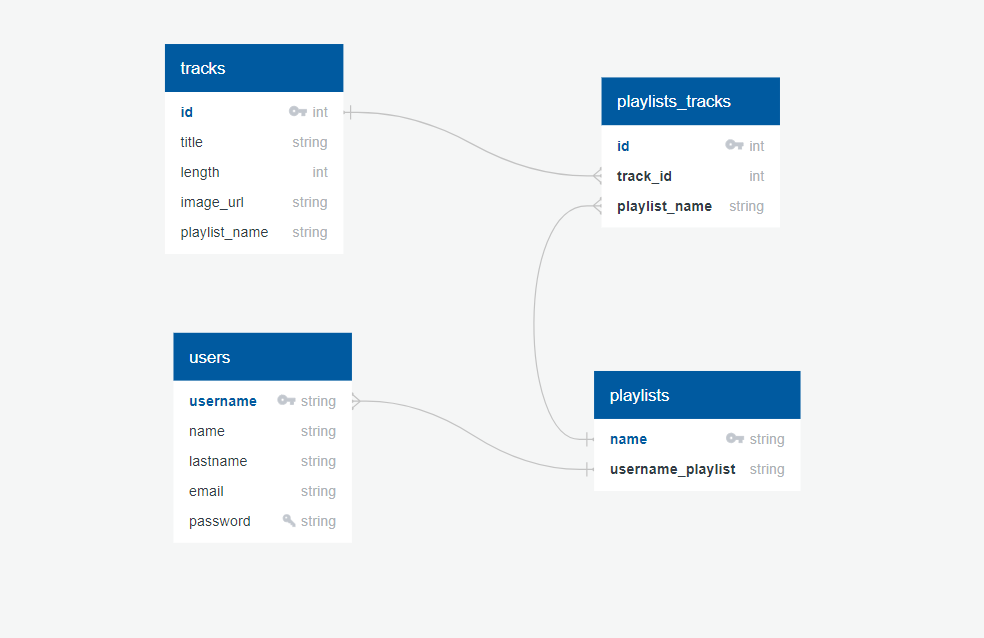

Schema:



# TuneFlow App

TuneFlow is a music application that allows users to discover, create, and share playlists. It utilizes PostgreSQL for the database, Node.js for the backend, and React for the frontend. This README provides an overview of the application, installation instructions, and other relevant details.

## Table of Contents

- [Features](#features)
- [Technologies Used](#technologies-used)
- [Installation](#installation)
- [Usage](#usage)
- [API Endpoints](#api-endpoints)
- [Database Schema](#database-schema)
- [Contributing](#contributing)
- [License](#license)

## Features

- Create and manage playlists.
- Add and remove tracks from playlists.
- Discover new music through recommendations.
- User authentication and authorization.
- Responsive and user-friendly interface.

## Technologies Used

- **Backend:**
  - Node.js
  - Express
  - PostgreSQL (Database)

- **Frontend:**
  - React
  - React Router
  - Axios (HTTP requests)

- **API:**
  - Custom API built with Express

- **Authentication:**
  - JWT (JSON Web Tokens)

## Installation

1. **Clone the repository:**

   ```bash
   git clone https://github.com/your-username/tuneflow-app.git
   cd tuneflow-app
